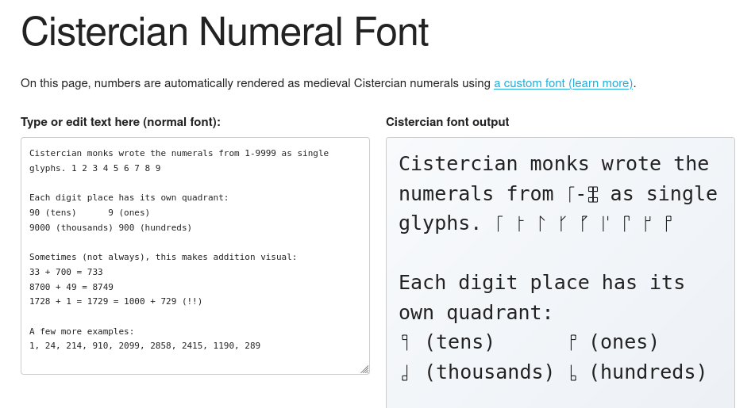

# Cistercian Numeral Font

A web font that automatically converts numbers (1–9999) into [Cistercian numerals](https://en.wikipedia.org/wiki/Cistercian_numerals) using OpenType ligatures.

Why a font instead of images? With a font, you can copy-paste and search the numbers directly.
And, it's fun to use ligatures to combine characters.

**[Live demo →](https://bobbiec.github.io/cistercian-font.html)**

(https://bobbiec.github.io/cistercian-font.html)

## Quick start

The pre-built font files are included in `fonts/`. Copy them into your project and add the CSS:

```css
@font-face {
  font-family: "Cistercian";
  src:
    url("fonts/Cistercian.woff2") format("woff2"),
    url("fonts/Cistercian.woff") format("woff");
}

.cistercian {
  font-family: "Cistercian", monospace;
  font-feature-settings:
    "liga" 1,
    "dlig" 1;
}
```

Then use it in HTML:

```html
<span class="cistercian">1234</span>
```

The ligature engine replaces digit sequences with the corresponding Cistercian glyph automatically.

## How it works

1. **Glyph generation** (`node src/generate-glyphs.js`) — uses the upstream [codepo8/cistercian](https://github.com/codepo8/cistercian/) SVG generator (included as a git submodule) to produce 9 999 normalised SVG files.
2. **Font building** (`python3 src/build-font.py`) — imports the SVGs into a FontForge font, wires up OpenType `liga`/`dlig` substitution rules, and exports TTF → WOFF → WOFF2 via fonttools.

## Building from source

You only need to rebuild if you want to change the glyph style or font metrics. The pre-built fonts in `fonts/` are ready to use.

### Prerequisites

| Tool                        | Install                                                    |
| --------------------------- | ---------------------------------------------------------- |
| Node.js ≥ 14                | <https://nodejs.org/>                                      |
| Python 3                    | usually pre-installed                                      |
| FontForge + Python bindings | `apt install python3-fontforge` / `brew install fontforge` |
| fonttools + brotli          | `pip install fonttools brotli`                             |

### Build

```bash
git clone --recursive https://github.com/bobbiec/cistercian-font.git
cd cistercian-font
./build.sh            # or: npm run build
```

If you already cloned without `--recursive`, fetch the submodule first:

```bash
git submodule update --init
```

## Project layout

```
├── fonts/                  # Pre-built font files (committed)
│   ├── Cistercian.woff2
│   ├── Cistercian.woff
│   └── Cistercian.ttf
├── src/
│   ├── generate-glyphs.js  # SVG glyph generator (Node.js)
│   └── build-font.py       # Font builder (Python + FontForge)
├── cistercian-source/      # git submodule → codepo8/cistercian
├── build.sh                # One-step build script
└── package.json
```

## Credits

- Cistercian SVG generator by [Chris Heilmann](https://github.com/codepo8/cistercian/) ([writeup here](https://christianheilmann.com/2026/01/13/monky-business-creating-a-cistercian-numerals-generator/))
- The code in this repo was largely generated by [Kilo](https://kilo.ai/)
